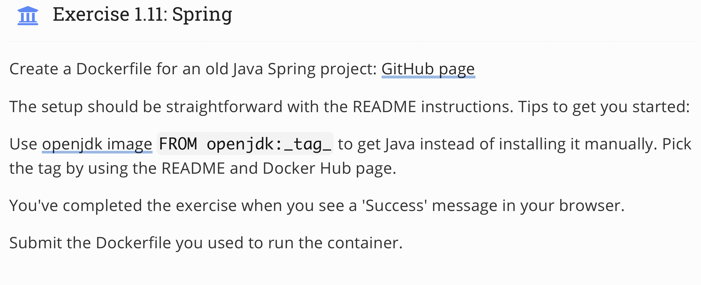

## Topic 
 

## My answer
#### Step
1. Create new `Dockerfile` with content
```
FROM openjdk:11
EXPOSE 8080
WORKDIR /usr/src/app
COPY . .
RUN ./mvnw package
CMD ["java", "-jar", "./target/docker-example-1.1.3.jar"]
```
2. Build and Run image
```
docker build . -t "spring-example-project"
docker run -p 8080:8080 spring-example-project
```
#### Result


