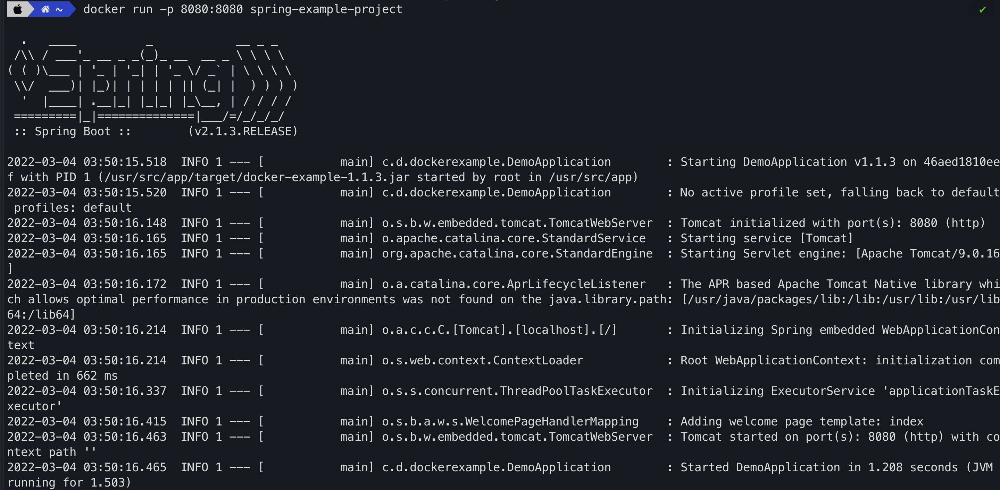

## Topic 
 

## My answer
#### Step
1. Create new `Dockerfile` with content
```
FROM node:16.14
WORKDIR /usr/src/app
EXPOSE 5000
COPY . .
RUN apt update && apt install -y npm
ENV REACT_APP_BACKEND_URL=http://localhost:5000
RUN npm install
RUN npm install -g serve
RUN npm run build
CMD ["serve", "-s", "-l", "5000", "build"]
```
2. Run iamge
```
docker run -p 5001:5000 example-frontend
```
#### Result


