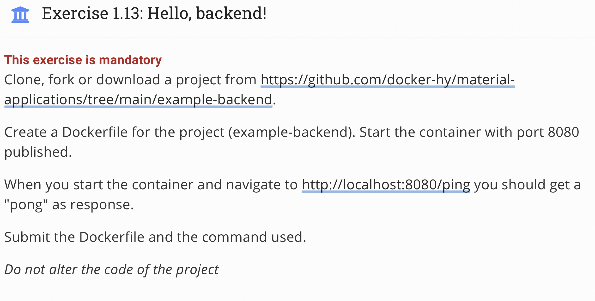
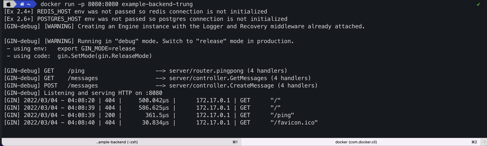

## Topic 
 

## My answer
#### Step
1. Create new `Dockerfile` with content
```
FROM golang:1.16
WORKDIR /usr/src/
COPY . .
ENV PORT=8080
EXPOSE 8080
ENV REQUEST_ORIGIN=https://example.com
RUN go build
RUN go test ./...
CMD ./server
```
2. Build and Run image
```
docker build . -t "example-backend-trung"
docker run -p 8080:8080 example-backend-trung
```
#### Result


