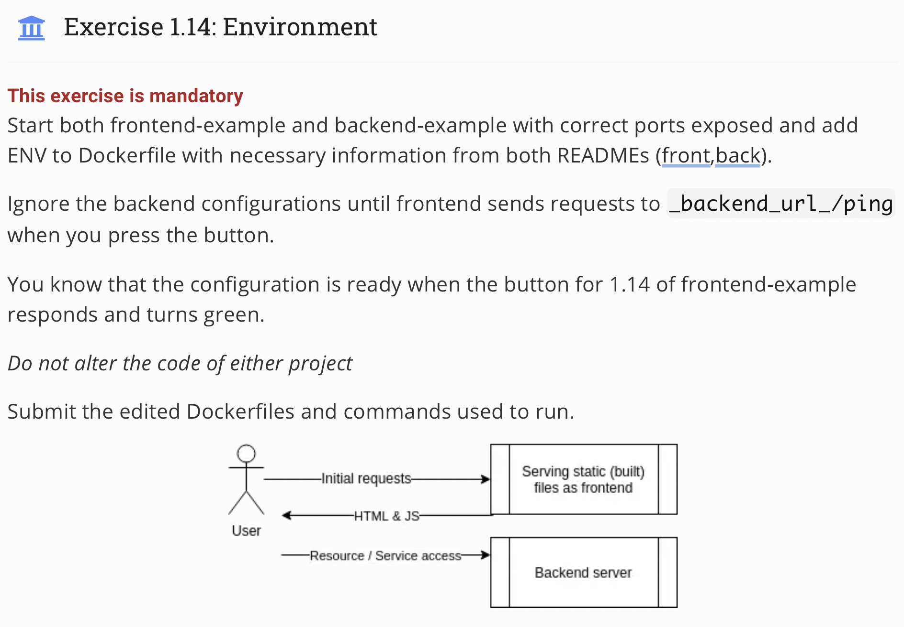
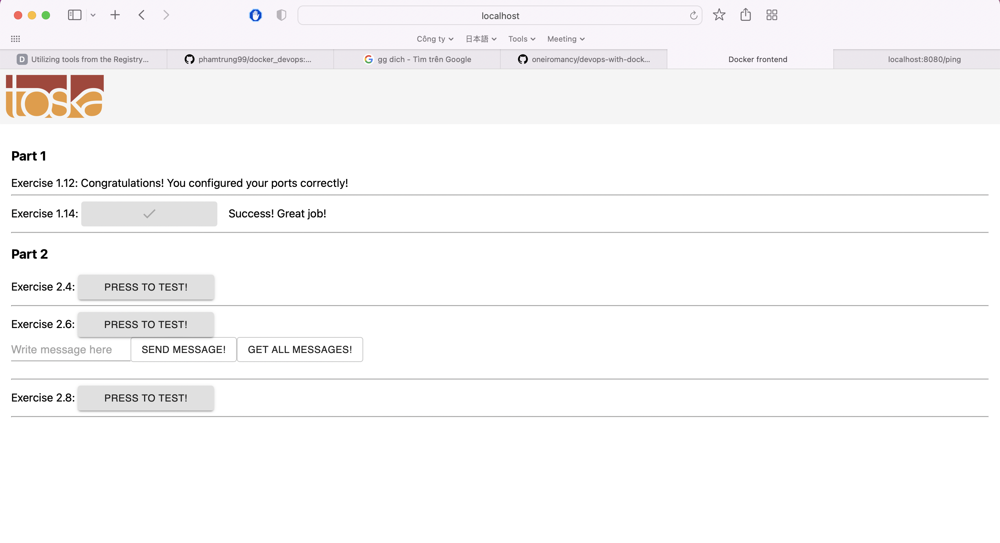

## Topic 
 

## My answer
#### Step
1. Modify `Dockerfile` of `example-frontend` and build again
```
ENV REACT_APP_BACKEND_URL=http://localhost:8080
```
and `example-backend-trung`
```
ENV REQUEST_ORIGIN=http://localhost:5001
```
2. Build and Run image `example-fontend` and run `example-backend-trung`
```
docker run -p 8080:8080 example-backend-trung
docker run -p 5001:5000 example-frontend
```
#### Result


