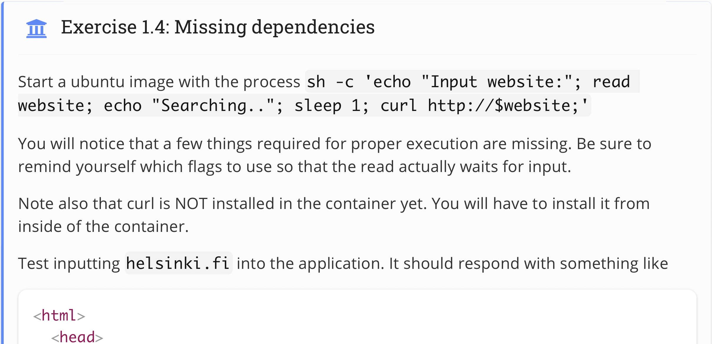
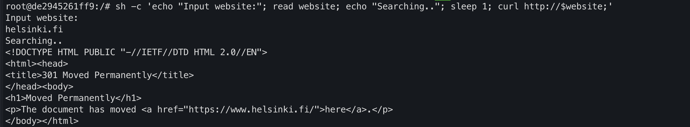

## Topic 
 

## My answer
#### Step
1. Run docker container and access to it's bash
```
docker run -it --name looper ubuntu bash
```

2. Install curl inside container
```
apt-get udpate 
apt-get install curl 
```

3. Run sh command
```
sh -c 'echo "Input website:"; read website; echo "Searching.."; sleep 1; curl http://$website;'
```
Then, type `helsinki.fi`     

#### Result

