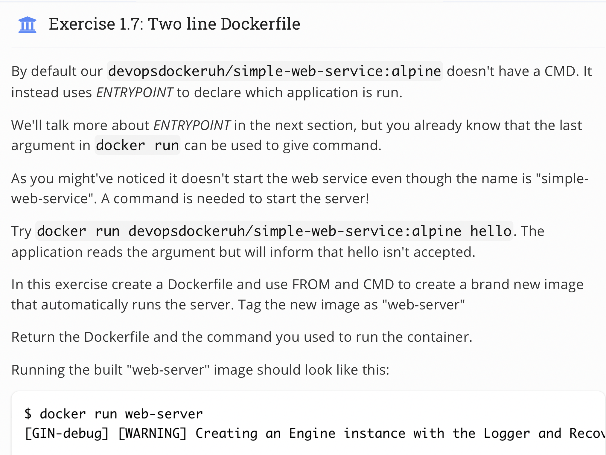
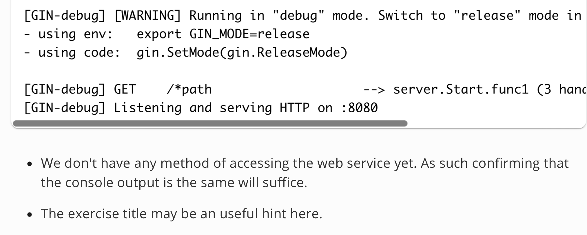
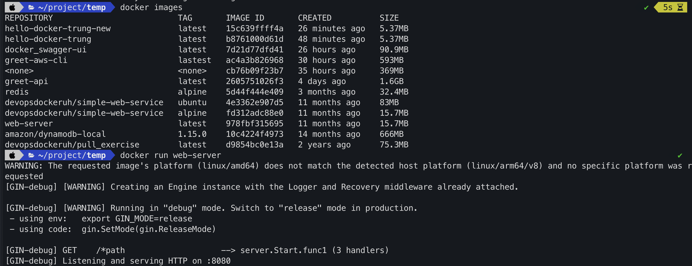

## Topic 
 
 

## My answer
#### Step
1. First, create `Dockerfile` with content:
```
FROM devopsdockeruh/simple-web-service:alpine
CMD server
```
`FROM` mean it build base on `devopsdockeruh/simple-web-service:alpine` image.
It's use that image's metadata and just add CMD server to dockerfile
2. Docker build
Now let build the image from dockerfile.
```
docker build . -t web-server
```

3. Run image
```
docker run web-server
```
#### Result


