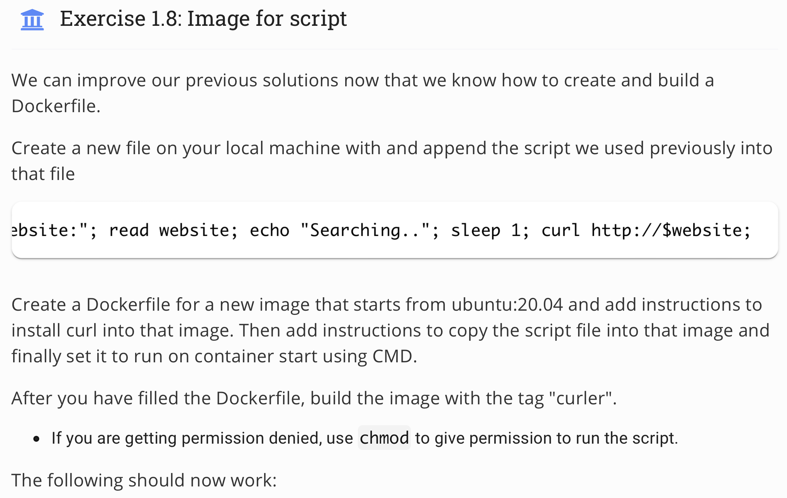
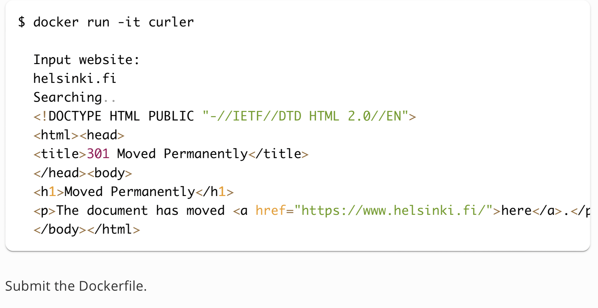
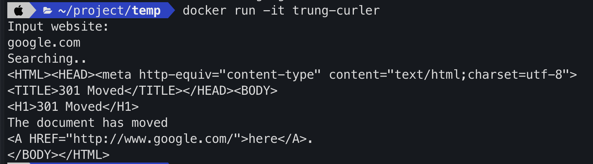

## Topic 
 
 

## My answer
#### Step
1. First, create `Dockerfile` with content:
```
FROM ubuntu:20.04
WORKDIR /usr/src/app
COPY web-script.sh .
RUN apt-get update
RUN apt-get install -y curl
RUN chmod +x web-script.sh
CMD ./web-script.sh
```
2. Create `web-script.sh` with content:
```
echo "Input website:"; read website; echo "Searching.."; sleep 1; curl http://$website;
```

3. Docker build
```
docker build . -t trung-curler
```

4. Run image
```
docker run -it trung-curler
```

#### Result


