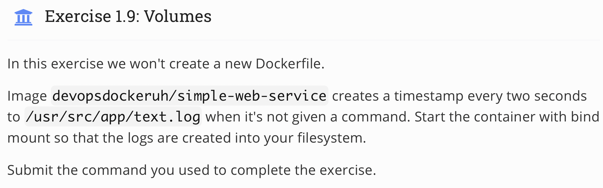
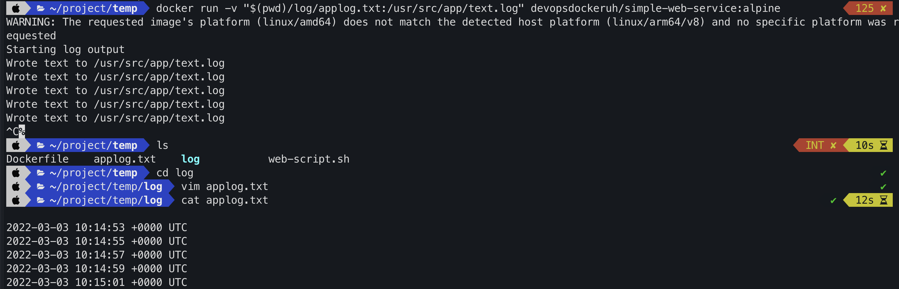

## Topic 
 

## My answer
#### Step
1. Run image with command
```
docker run -v "$(pwd)/log/applog.txt:/usr/src/app/text.log" devopsdockeruh/simple-web-service:alpine
```
Its mean we want to mount the file in container `/usr/src/app/text.log` to outside, in my computer directory is `/log/applog/.txt`.

#### Result


