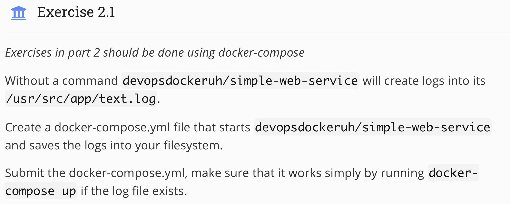
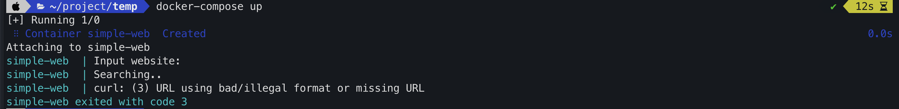

## Topic 
 

## My answer
#### Step
1. Create `docker-compose.yml` with content
```
version: '3.8'
services:
 simple-web:
  image: devopsdockeruh/simple-web-service
  build: .
  volumes:
   - ./log:/usr/src/app/text.log
  container_name: simple-web
```

2. Run `docker-compose up`
#### Result


