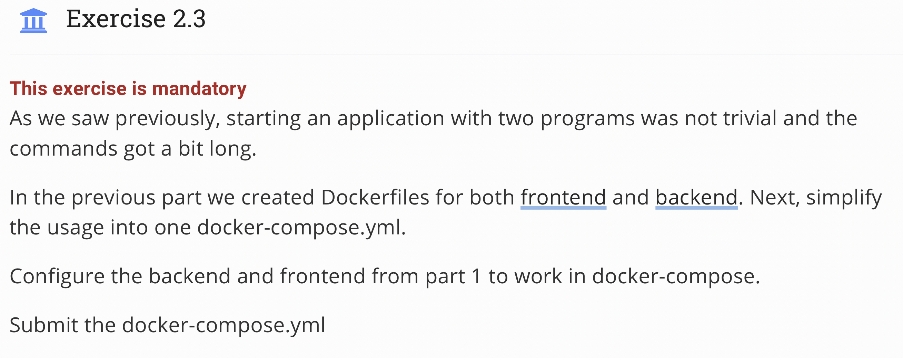
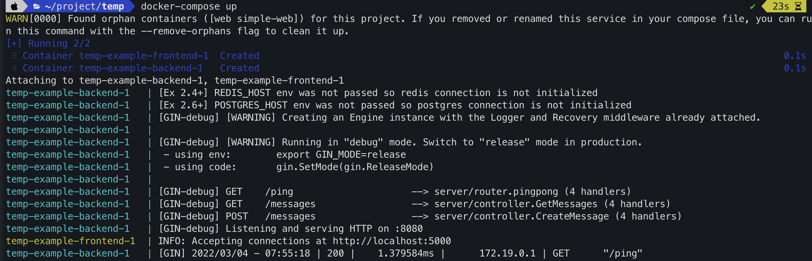

## Topic 
 

## My answer
#### Step
1. Create `docker-compose.yml` with content
```
version: "3.9"

services:
 example-frontend:
  image: example-frontend-trung
  build: .
  ports:
   - "5001:5000"

 example-backend:
  image: example-backend
  build: .
  ports:
   - "8080:8080"
```

2. Run `docker-compose up`

#### Result


