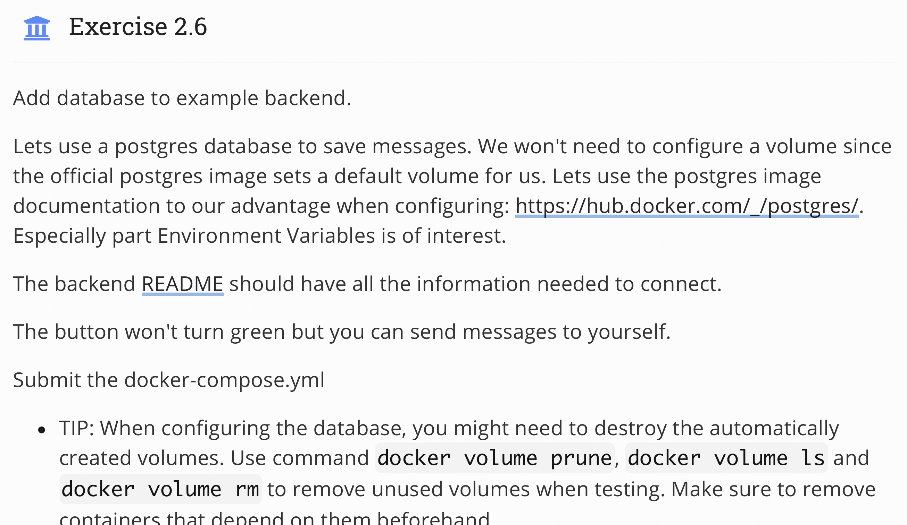
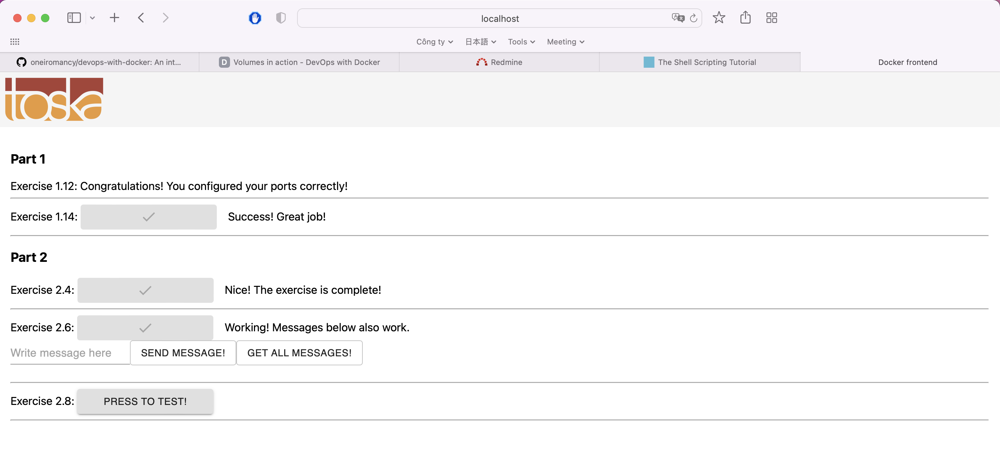

## Topic 
 

## My answer
#### Step

1. Create `docker-compose.yml` in root.
``` docker
  1 version: "3.9"
  2
  3 services:
  4     example-backend:
  5         container_name: temp-example-backend-1
  6         build: ./example-backend
  7         environment:
  8             REDIS_HOST: redis
  9             POSTGRES_HOST: postgres
 10             POSTGRES_USER: postgres
 11             POSTGRES_PASSWORD: postgres
 12             POSTGRES_DATABASE: postgres
 13         depends_on:
 14             - redis
 15             - postgres
 16         ports:
 17             - 8080:8080
 18     example-frontend:
 19         container_name: temp-example-frontend-1
 20         build: ./example-frontend
 21         depends_on:
 22             - backend
 23         ports:
 24             - 5001:5000
 25     redis:
 26         container_name: redis
 27         image: redis
 28         restart: unless-stopped
 29     postgres:
 30         container_name: postgres
 31         image: postgres
 32         environment:
 33             # POSTGRES_PASSWORD is the only one required for database initialisation
 34             POSTGRES_HOST: postgres
 35             POSTGRES_USER: postgres
 36             POSTGRES_PASSWORD: postgres
 37             POSTGRES_DATABASE: postgres
```

#### Result


